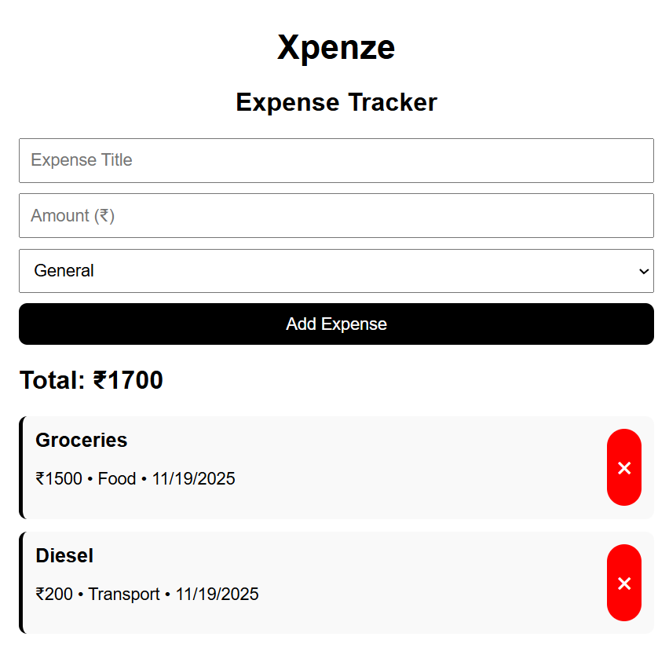

# Simple Expense Tracker

A **React-based Expense Tracker app** to help you manage your daily expenses efficiently.  
Add, edit, and delete expenses, and visualize your spending with a clean and modern UI.

---

## **📸 Screenshot**




---

## **💡 Features**

- Add new expenses with category, amount, and date
- Edit or delete existing expenses
- View all expenses in a structured list
- Clean, responsive, and user-friendly interface

---

## **🛠 Tech Stack**

- **Frontend:** React, JSX, CSS
- **Bundler:** Vite
- **Version Control:** Git & GitHub

---

## **🚀 Installation**

1. Clone the repository:

```bash
git clone https://github.com/kanijayachandran-sys/Simple_Expense_tracker.git
